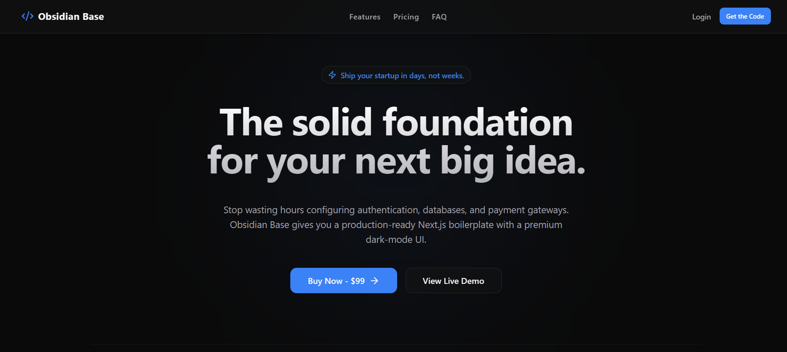
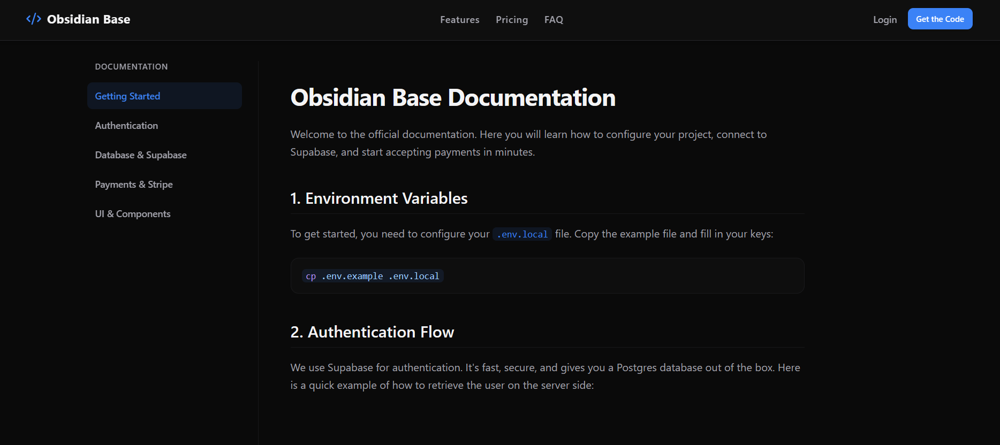

# 💎 Obsidian Base

> Ship your startup in days, not months. The ultimate Next.js boilerplate with Supabase Auth, Stripe billing, and premium Glassmorphism UI out of the box.


Obsidian Base is a production-ready SaaS starter kit designed for developers who want to focus on their business logic, not on reinventing the wheel. It comes with a dark-mode first, high-contrast aesthetic, ensuring your product looks premium from day one.



---

## ✨ Features

*   **Framework:** Next.js (App Router) for blazing-fast server-side rendering and static generation.
*   **Authentication & Database:** Deeply integrated Supabase SSR auth, protected routes, and PostgreSQL with pre-configured Row Level Security (RLS).
*   **Billing & Subscriptions:** Full Stripe integration, including Checkout sessions and a fully tested Webhook infrastructure to automatically manage user states.
*   **Premium UI/UX:** Built with Tailwind CSS and Radix UI. Features a minimalist, dark-mode exclusive "Glassmorphism" design system.
*   **Transactional Emails:** Ready-to-use email templates built with React Email. Choose between Resend or Mailchimp (Transactional & Marketing).
*   **Native Documentation Engine:** Built-in MDX support with `rehype-pretty-code`. Write your docs or blog posts in Markdown, and let the system render beautiful code blocks and typography.
*   **SEO Optimized:** Dynamic `sitemap.xml`, `robots.txt`, and Open Graph meta tags pre-configured.

---

## 🚀 Getting Started

Follow these steps to get your SaaS up and running in your local environment.

### 1. Clone the repository and install dependencies

git clone [Obsidian Base](https://github.com//obsidian-base.git)

```bash
cd my-saas
npm install
```

## 2. Configure Environment Variables

Copy the example environment file and fill in your keys.

```bash
cp .env.example .env.local
```

## 3. Setup the Database (Supabase)

- Create a new project in your [Supabase Dashboard.](https://supabase.com/) 
- Supabase Dashboard.
- Navigate to the SQL Editor.

Copy the contents of the `supabase/schema.sql` file provided in this repository and run it. This will instantly create your `users` and `subscriptions` tables with the correct RLS policies.


## 4. Setup Stripe Webhooks (Local Environment)

To test payments locally, use the Stripe CLI to forward events to your local server:

```bash
stripe login
stripe listen --forward-to localhost:3000/api/webhooks/stripe
```
*Don't forget to copy the generated webhook signing secret (whsec_...) and paste it into your .env.local.*


## 5. Start the Development Server
Run the local server using Webpack (configured to fully support MDX plugins):

```bash
npm run dev
```
Open `http://localhost:3000` with your browser to see the result.


## 6. 📚 Documentation



Obsidian Base comes with its own documentation portal out of the box. Once the development server is running, navigate to `http://localhost:3000/docs` to read the complete guide on authentication, database schema, payment configuration, and UI components.


## 7. 🛠️ Tech Stack

- Next.js - React framework
- Supabase - Open source Firebase alternative
- Stripe - Payment infrastructure
- Tailwind CSS - Utility-first CSS framework
- React Email - Build emails with React
- Mailchimp - Transictional emails and newsletter


## 8. 📄 License

This boilerplate is proprietary. You are free to use it to build unlimited commercial or personal projects. You are not allowed to resell, distribute, or publicly share the source code of the boilerplate itself.


## 9. Contact